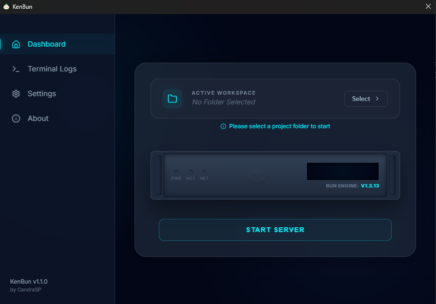

# 🥟 KenBun v1.1.0 - Professional Bun Server Manager

KenBun is a premium Desktop application (GUI) designed specifically to manage **Bun.sh** servers easily, quickly, and elegantly. Without needing to repeatedly type commands in the terminal, KenBun provides full control over your Bun projects through an advanced interface.

---

## 🚀 Key Features

KenBun is not just a typical server launcher. This application is specifically designed and focused on the following features to streamline your workflow:

### 1. Smart Project Management
- **Quick Switch Workspace**: Switch between project folders with just a few clicks, without needing to close the application.
- **Auto-Project Detection**: KenBun automatically detects if the folder you selected is a valid Bun project based on the files inside it.

### 2. Server Stability & Security
- **Port Conflict Detection**: KenBun proactively detects if the port you want to use is currently being used by another application. It will prompt you to change the port to prevent network conflict errors.
- **Auto-Restart on Crash**: Did your server suddenly crash due to a bug in the code? Don't worry, KenBun will immediately restart it automatically.
- **Exponential Back-off**: A smart restart strategy that prevents your system from becoming overloaded when the server crashes repeatedly in quick succession.

### 3. Integrated Console
- **Real-time Log Output**: Monitor all server logs (stdout/stderr) directly from the KenBun interface in real-time, without needing to open an external terminal.

---

## 🛠️ System Requirements

For KenBun to run perfectly, make sure your computer meets the following criteria:

### Main Requirements
- **Operating System**: Windows 10 or Windows 11 (64-bit).
- **Bun Runtime**: You must have **Bun** installed on your operating system. If it is not installed, KenBun will guide you the first time it is opened.
- **Environment PATH**: The `bun` command must be registered in your PATH Environment Variables so it can be called by KenBun.

### Hardware Requirements
- **Storage**: Minimum 50 MB of free space for KenBun.
- **Display**: Screen resolution of 1024x768 or higher for optimal interface display.

---

## 📖 How to Use

Using KenBun is very easy, just follow the steps below:

1. **Open Application**: Run the KenBun application you have installed/downloaded.
2. **Select Project Folder**: Click the **"Select"** button at the top to choose your Bun project directory folder.
3. **Server Configuration**: 
   - Specify the **Port** you want to use (e.g., `3000`).
   - Enter the name of the **Main File** to be executed (e.g., `index.js` or `server.ts`).
4. **Start Server**: Click the large **"START SERVER"** button. The Bun server will immediately run in the background!
5. **Monitor Logs**: You can directly view all interactions, errors, or server status in the **Console Log** section below it.
6. **Stop**: To shut down the server, simply click the **"STOP SERVER"** button.

---

Developed with ❤️ for the Bun community by **CandraSP**
